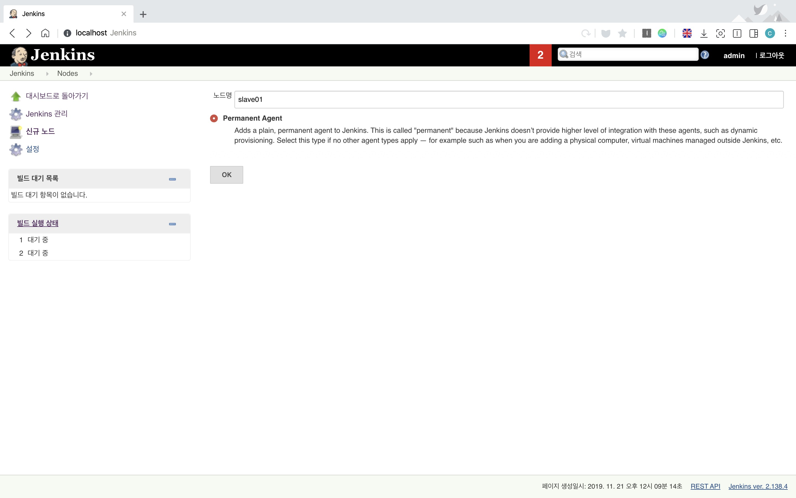

# 06. 컴포즈로 여러 컨테이너 실행하기
* Compose는 docker 명령을 사용해 컨테이너를 실행할 때 매번 입력하던 **옵션을 설정 파일로 관리**할 수 있습니다.
* **여러 컨테이너를 실행**할 때 컨테이너의 실행 명령, 옵션을 코드로 관리하고 실행 순서 등도 지정하여 보다 편리하게 여러 컨테이너의 실행/종료를 관리할 수 있습니다.

## 젠킨스 컨테이너 실행하기
```
version: '3.7'
services:
  master:
    container_name: master
    image: jenkinsci/jenkins:2.138.4-slim
    ports:
      - 8080:8080
    volumes:
      - ./jenkins_home:/var/jenkins_home
```

> 책에서는 2.142-slim 버전의 jenkins 이미지를 사용하고 있는데, 해당 이미지로 실행하면 설치할 때 오류가 뜹니다. 2.138.4-slim 버전 이미지를 사용합시다. 

* **volumes** : `Dockerfile`의 **COPY** 명령어나 `docker container cp` 명령어와 달리, **호스트와 컨테이너 사이에 파일을 공유**하는 방법입니다. 호스트와 컨테이너가 동일한 파일을 사용하기 때문에 컨테이너에서 파일을 수정하면 호스트에서도 변경된 것을 볼 수 있습니다.
	* 현재 위치의 `jenkins_home` 디렉토리를 컨테이너의 `/var/jenkins_home`에 마운트합니다.
* `docker-compose up`으로 실행합니다. **jenkinsci/jenkins:2.142-slim** 이미지가 없다면, 해당 이미지를 다운로드 한 후 실행됩니다. 

```
master    | Jenkins initial setup is required. An admin user has been created and a password generated.
master    | Please use the following password to proceed to installation:
master    | 
master    | 6b0118389b4341e08e494cb*********
master    | 
master    | This may also be found at: /var/jenkins_home/secrets/initialAdminPassword
master    | 
master    | *************************************************************
master    | *************************************************************
```

* 실행 결과에서 *Please use the following password to proceed to installation:* 메세지 다음에 뜨는 해시값이 있는데, 초기 설정에서 필요한 패스워드이므로 복사해둡니다. 
* *INFO: Jenkins is fully up and running* 라는 메세지가 뜨면 브라우저에서 `http://localhost:8080`으로 접속합니다. 
  * `docker-compose.yaml`에서 호스트의 8080 포트와 매핑했기 때문에, 호스트의 8080 포트와 컨테이너의 8080 포트가 연결되어 있어서 접속이 가능한 것입니다.
  

  
**Administrator password**에 앞에서 복사해 둔 패스워드를 입력합니다.  


* **Jenkins 설치** :  **Install suggested plugins**를 선택합니다. **Getting Started** 라는 페이지가 뜨면 설치가 진행되는 것이므로 설치를 기다립니다. 
* **Create First Admin User** 에서 로그인 정보를 설정합니다. 


> 헷갈리니까, 여기서는 무작정 다 admin으로 설정해버렸습니다.

### 설정 후 Jenkins 메인화면 


## 마스터 젠킨스 용 SSH 설정

* 젠킨스를 운영할 때, 단일 서버로 운영하기 보다는 마스터-슬레이브 구조로 운영하는 경우가 많습니다. 
    * **마스터(Master)** :  관리 기능, 작업 지시 기능을 담당
    * **슬레이브(Slave)** : 실제 작업의 수행 
* 젠킨스의 마스터-슬레이브 구조를 Docker Compose로 만들 수 있습니다.

> 젠킨스 분산 빌드 환경(master-slave 패턴)에 대한 더 자세한 설명은 [링크한 이 글](http://blog.naver.com/PostView.nhn?blogId=rudnfskf2&logNo=221400958621&parentCategoryNo=&categoryNo=58&viewDate=&isShowPopularPosts=true&from=search)을 참고해주세요.

```
$ docker container exec -it master ssh-keygen -t rsa -C ""
```

* master 컨테이너(`docker-compose.yml`에서 설정해 준 이름)에 접속해서 SSH 키를 생성합니다.
* 컨테이너에서 `/var/jenkins_home/.ssh/id_rsa.pub` 파일이 생성되는데, **volume**으로 연결해 둔 호스트의 `jenkins_home` 디렉토리에서 확인할 수 있습니다.  

## 슬레이브 젠킨스 컨테이너 생성
```
version: '3.7'
services:
  master:
    container_name: master
    image: jenkinsci/jenkins:2.138.4-slim
    ports:
      - 8080:8080
    volumes:
      - ./jenkins_home:/var/jenkins_home
    links:
      - slave01

  slave01:
    container_name: slave01
    image: jenkinsci/ssh-slave
    environment:
      - JENKINS_SLAVE_SSH_PUBKEY=ssh-rsa AAAAB3NzaC1...
```

* **slave01** : 슬레이브 컨테이너의 정보를 추가합니다.
    * `JENKINS_SLAVE_SSH_PUBKEY` : 호스트의 `./jenkins_home/.ssh/id_rsa.pub`에 있는 내용을 그대로 복사해서 저장합니다.
    * 슬레이브 컨테이너 안에서 키를 받아오거나 설정해서는 안되며, 외부 환경 변수로 받아오게 해야합니다.
* **links** : 마스터 컨테이너가 슬레이브를 찾아서 추가할 수 있도록 컴포즈에서 제공하는 links 옵션으로 slave01 컨테이너를 연결해줍니다. 

## 마스터 젠킨스에서 슬레이브 등록하기

* `docker-compose down`으로 실행하고 있던 컴포즈를 종료하고, 슬레이브 컨테이너가 추가된 컴포즈 파일로 실행합니다.
* 마스터 젠킨스에 접속(`localhost:8080`)해서 **Jenkins 관리 > 노드 관리 > 신규 노드 생성**을 선택합니다.




* 다음 화면과 같이 내용을 입력합니다.
* **Credentials**는 원래 --none-- 으로 되어있는데, 옆의 ADD를 선택하고 Jenkins를 선택하면 아래 화면과 같은 창이 뜹니다.


* 다음 화면과 같이 내용을 입력하고 저장하면 slave01이 추가됩니다.
* **Private Key** : `./jenkins_home/.ssh/id_rsa`의 내용을 입력하면 됩니다.

### [ERROR] 슬레이브 젠킨스 등록 오류
책에 명시되어 있는 `jenkinsci/ssh-slave` 이미지를 사용하면 다음과 같은 오류가 발생합니다. 

```
[11/21/19 12:46:11] [SSH] Checking java version of /usr/local/java/bin/java
Couldn't figure out the Java version of /usr/local/java/bin/java
bash: /usr/local/java/bin/java: No such file or directory

java.io.IOException: Java not found on hudson.slaves.SlaveComputer@4acfbd78. Install a Java 8 version on the Agent.
	at hudson.plugins.sshslaves.JavaVersionChecker.resolveJava(JavaVersionChecker.java:82)
	at hudson.plugins.sshslaves.SSHLauncher$2.call(SSHLauncher.java:863)
	at hudson.plugins.sshslaves.SSHLauncher$2.call(SSHLauncher.java:833)
	at java.util.concurrent.FutureTask.run(FutureTask.java:266)
	at java.util.concurrent.ThreadPoolExecutor.runWorker(ThreadPoolExecutor.java:1149)
	at java.util.concurrent.ThreadPoolExecutor$Worker.run(ThreadPoolExecutor.java:624)
	at java.lang.Thread.run(Thread.java:748)
[11/21/19 12:46:11] Launch failed - cleaning up connection
[11/21/19 12:46:11] [SSH] Connection closed.
```

* `jenkinsci/ssh-slave` 이미지를 `jenkins/ssh-slave` 이미지로 변경해봐도 안되네요. ~~해당 이슈를 해결하지 못해서 이후 과정은 진행하지 못하고 넘어가게 되었습니다. 해결방법을 아시는 분은 이슈 남겨주시면 감사하겠습니다.~~
* **해결방법** : `jenkins/ssh-slave:jdk11` 이미지를 사용하니 정상적으로 등록됩니다. *문제를 해결해서 너무너무 기쁩니다.*

## 더 나은 컨테이너 개발
* 위의 과정에서 마스터-슬레이브 젠킨스 구축을 위해서는 SSH 설정 등을 위해 수작업이 필요했지만, **이상적인 도커 구성 관리는 수작업의 과정 없이 애플리케이션을 바로 이용**할 수 있는 수준이어야 합니다.
* 다음 장에서는 설정만으로 도커 구성 관리를 완성할 수 있는 방법을 공부합니다.
